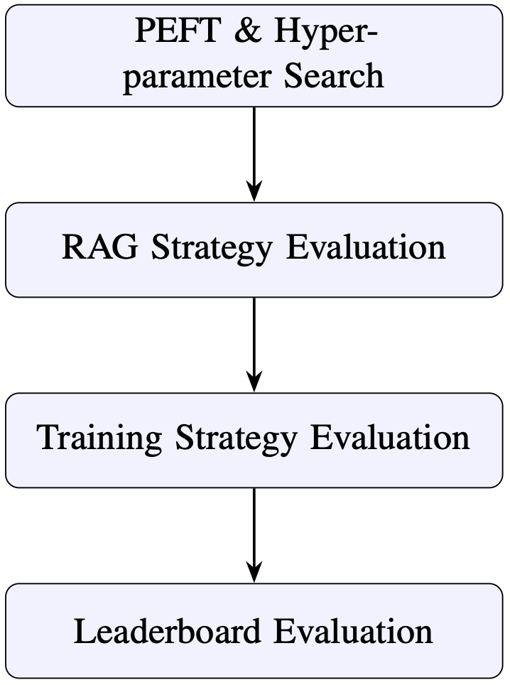
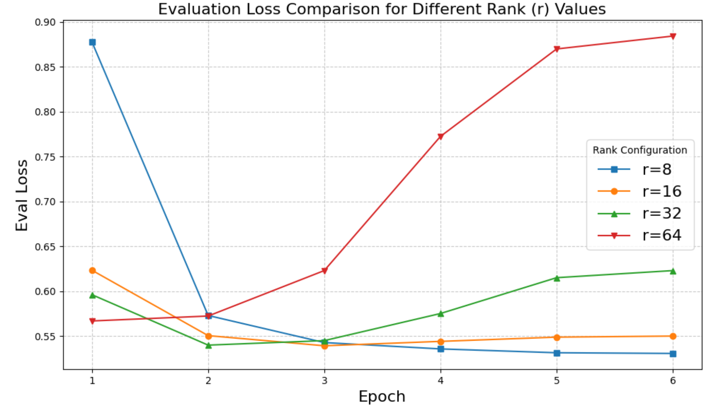
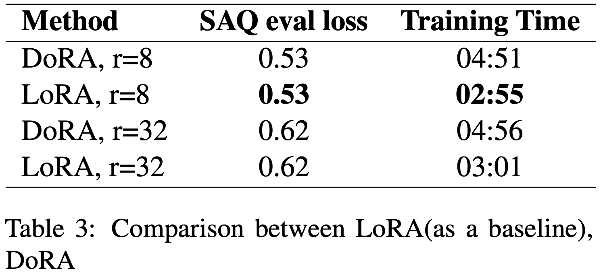
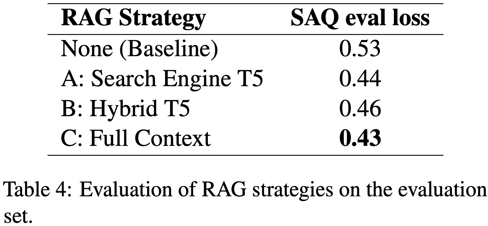

# LLM Cultural QA

This project focuses on fine-tuning Large Language Models for cultural question answering tasks.

## Project Structure

```
LLM_cultural_qa/
├── data/              # Dataset files
├── results/           # Model predictions and outputs
├── script/
│   ├── train_and_predict.py      # Main training and prediction pipeline
│   └── search_context.py         # Context search and retrieval    
└── README.md
```

## Setup

### Requirements

Install the required packages:

```bash
pip install torch transformers datasets trl peft bitsandbytes
pip install sentence-transformers faiss-cpu rank-bm25
pip install pandas numpy matplotlib tqdm
```

### Configuration

1. Update model paths and data paths in the scripts according to your setup
2. For RAG functionality, set your Serper API key in `script/search_context.py`

## Methodology


## Model

This project uses Meta-Llama-3-8B-Instruct\Mistral-7B-Instruct-v0.2 with QLoRA fine-tuning for efficient training.

## Dataset

The models in this project were fine-tuned using the **BLEnD (Bilingual-Evaluated and Diverse)** dataset, available on Hugging Face: [nayeon212/BLEnD](https://huggingface.co/datasets/nayeon212/BLEnD).

## 🏁 Conclusion & Key Findings

Our experimental results provide critical insights into adapting Large Language Models for cultural knowledge tasks. By implementing the optimized strategies, we achieved an overall accuracy improvement of **19.4%** (from 0.62 to 0.74) compared to the zero-shot baseline.

### 💡 Core Insights

* **🛠️ Adapter Efficiency**: Integrating fine-tuning adapters is essential for instruction-following. Without adapters, the model frequently violated output formats. Additionally, We found increasing the rank beyond 8 causes the loss to increase, suggesting that the model is overfitting and can be checked by evaluation loss graph!

* **🌐 Layer-wide Optimization**: Extending trainable modules to **all layers** (Target Modules: All) yielded the best results, suggesting that cultural knowledge is distributed across the entire model architecture.

* **⚖️ LoRA vs. DoRA**: For small-scale cultural datasets, **LoRA outperformed DoRA**. While accuracy was comparable, DoRA's weight-decomposition proved too sensitive to sparse data, increasing training time without significant gains.

* **📚 RAG & Context Strategy**: Retrieval-Augmented Generation (RAG) is indispensable for factual grounding. The **Full Context** strategy achieved the lowest training loss, providing the best evidentiary support for long-tail cultural facts.

* **🔄 Cross-Task Synergies**: Sequential fine-tuning (SAQ ↔ MCQ) significantly outperformed single-task optimization. This cross-task reinforcement allowed the model to leverage task-specific knowledge transfer effectively.


